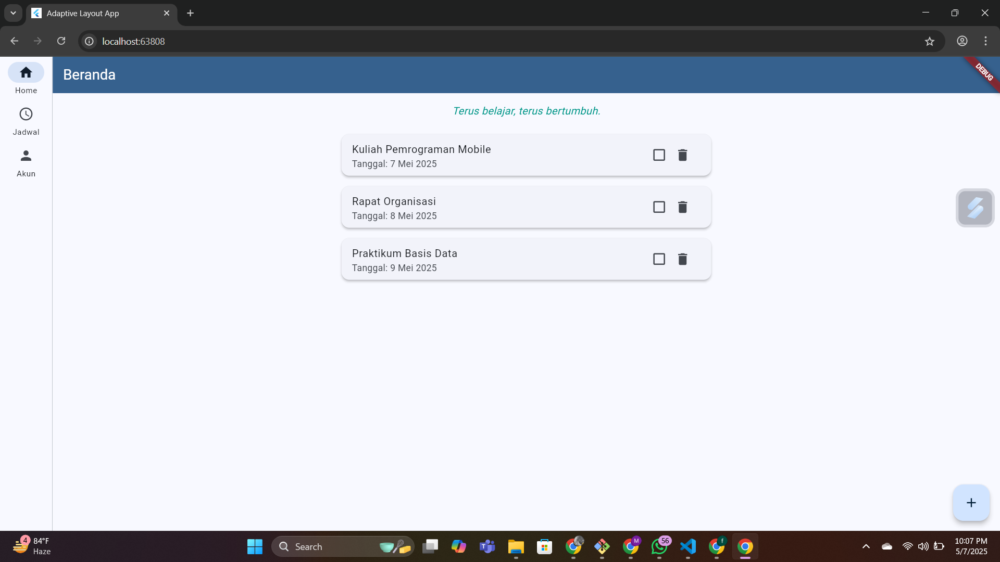
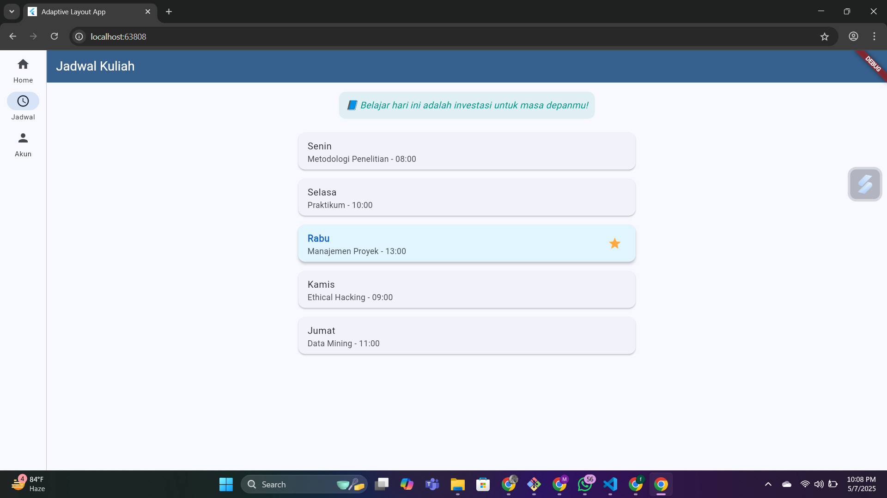
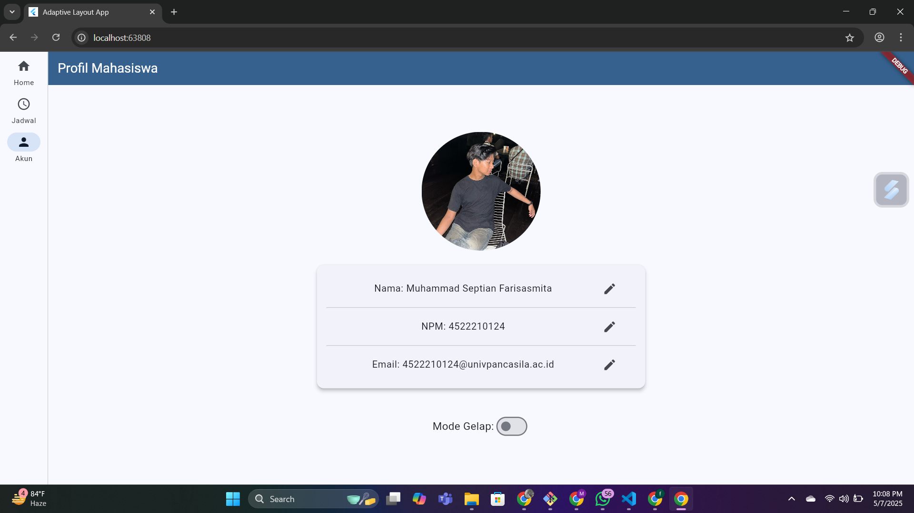
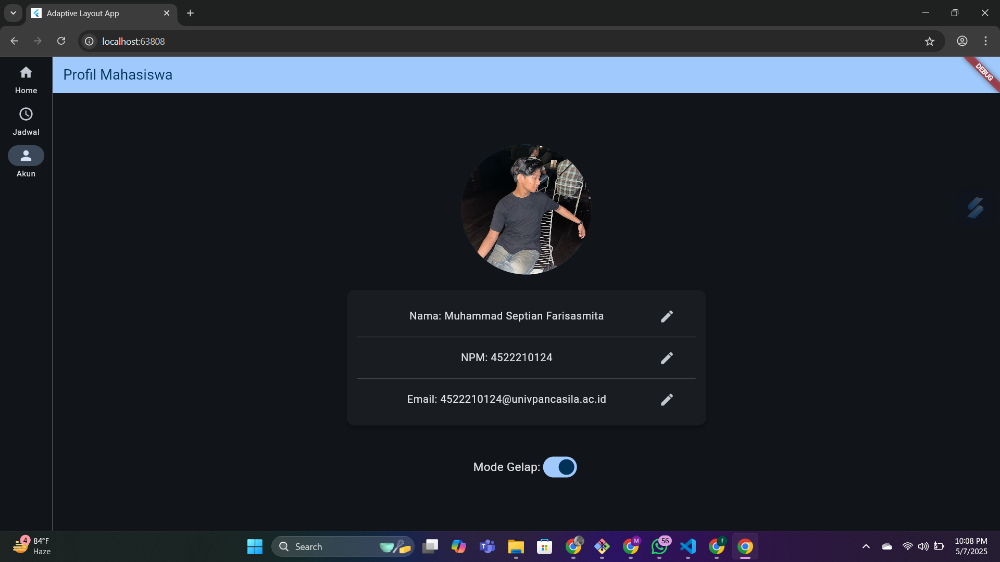
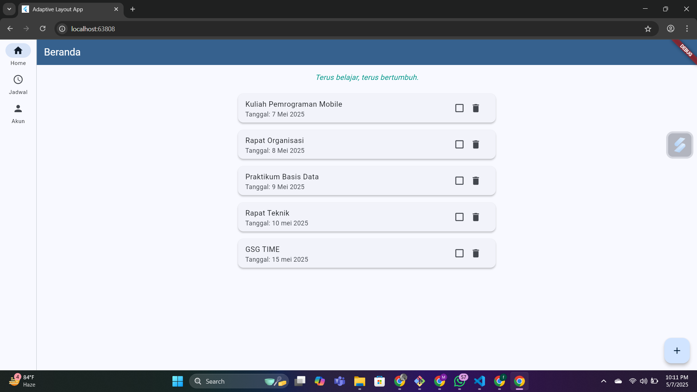
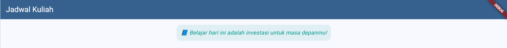

# flutter_uts_aplikasi_jadwal_kuliah_dan_kegiatan_mahasiswa_adapatif_interaktif

## Nama:

Muhammad Septian Farisasmita, NIM: 452210124

## Deskripsi Aplikasi:

Aplikasi ini adalah aplikasi Flutter adaptif dan responsif yang dirancang untuk menampilkan berbagai informasi penting bagi mahasiswa. Aplikasi ini terdiri dari tiga halaman utama: Beranda, Jadwal Kuliah, dan Profil Pengguna, dengan tampilan yang menyesuaikan ukuran layar perangkat. Aplikasi ini dilengkapi fitur-fitur seperti pengelolaan kegiatan, pengaturan tema gelap/terang, serta pengubahan informasi pengguna.

## Screenshot Emulator:

## Penjelasan Program:

- Program ini menggunakan NavigationRail untuk perangkat dengan layar lebar (tablet dan desktop) dan BottomNavigationBar untuk layar kecil (smartphone). Navigasi akan otomatis berubah tergantung pada breakpoint perangkat menggunakan flutter_adaptive_scaffold.
- Program ini menampilkan daftar kegiatan mahasiswa di halaman beranda. Kegiatan ditampilkan dalam bentuk kartu yang berisi nama, tanggal, dan checkbox untuk menandai apakah kegiatan telah selesai.
- Program ini memiliki fitur untuk menambahkan kegiatan baru melalui tombol FloatingActionButton. Pengguna dapat mengisi nama kegiatan dan tanggal dalam dialog input.
- Program ini menyediakan fitur untuk menghapus kegiatan dengan menekan ikon tempat sampah (delete) pada masing-masing kartu kegiatan.
- Program ini menampilkan jadwal kuliah mingguan pada halaman Jadwal. Setiap item jadwal ditampilkan dalam bentuk kartu berisi hari dan mata kuliah beserta jamnya.
- Program ini menampilkan informasi pengguna di halaman Profil, termasuk nama, NPM, dan email. Informasi ini dapat diubah melalui dialog input.
